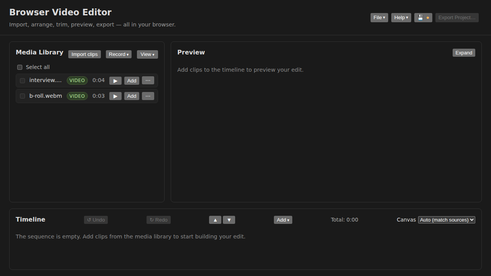
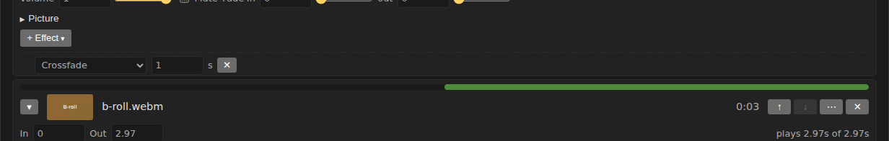
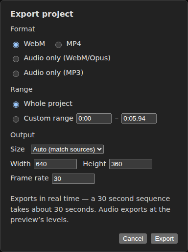

# Quick Start

One path from a folder of clips to a finished file, in about ten minutes. Every control named here has its own page elsewhere in the guide; follow a link when you want the detail, then come back.

The editor has three panels. The **Media library** (top left) holds the clips you bring in. The **Preview** (top right) plays the result. The **Timeline** (below them) is where the clips are arranged. [Concepts](concepts.md) explains how the three relate.

## 1. Import your clips

Click **Import clips** in the Media library and choose one or more video files, or drag the files from your desktop anywhere onto the page. Each clip appears as a row with its name, a kind badge and its duration. Audio files and images import the same way.

A file the browser cannot decode is listed under the library with the reason, so nothing disappears silently.

## 2. Put them on the timeline

Each library row has an **Add** button — its full name is *Add … to timeline*. Click it to append the clip to the **Sequence**, the top section of the timeline. Add two clips.

Sequence entries play one after another in the order they are listed. Each timeline row has **↑** and **↓** on its main line to move it, and **✕** to take it off the timeline; the clip stays in the library.

## 3. Trim

Click a row's **▾** to expand it. The **In** and **Out** fields set where the clip starts and stops playing, in seconds into its source file. Type a value and press Enter, or drag the slider beside the field. The row's coverage bar and the **Total** on the timeline header follow.

## 4. Add a transition

Between two adjacent sequence entries sits a **+ Transition** button. Click it: a crossfade of {{DEFAULT_TRANSITION_DURATION}} s appears, with a type menu and a duration field beside it. The type menu lists every transition the app has — slides, wipes, pushes, fades through black and white, irises and a cross-zoom. A transition overlaps the two clips, so the sequence gets shorter by its length.

## 5. Add a title

On the timeline header, open **Add ▾** and choose **Text overlay**. A text row appears in the **Text** section, showing *Title* in the centre of the frame for the first {{DEFAULT_TEXT_DURATION}} s. Type the words you want into the row's content field; expand the row to change when it shows and for how long, its position, font, size and colour.

## 6. Preview

Press **Play** under the preview, or press **Space** anywhere outside a text field. The seek bar underneath scrubs; the **←** and **→** keys step the playhead by {{STEP_SECONDS}} s, or {{LARGE_STEP_SECONDS}} s with Shift. Press **?** for every shortcut, or open **Help ▾ → Keyboard shortcuts…**.

## 7. Export

Click **Export Project…** in the header. The dialog lists the formats this browser can record, shows the output size and frame rate it will use, and offers the whole project or a range. Click **Export**: the file renders in real time — a thirty-second sequence takes about thirty seconds — and downloads when it finishes.

## 8. Save the project

Open **File ▾** and choose **Save**, or press Ctrl+S. The first save asks whether the project file should **embed the media** — one file that opens anywhere — or **store references only**, a small file that asks for the original media files when it is reopened. Either way the file holds the arrangement, every trim and setting, and the names you gave things; see [what is saved where](concepts.md#what-is-saved-where).

The 💾 button beside File ▾ saves too. A dot on it means there are unsaved changes.
